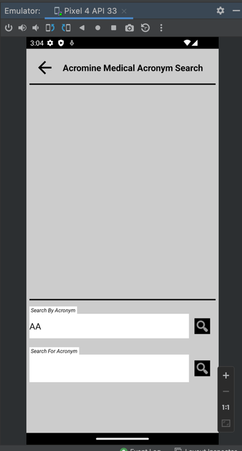
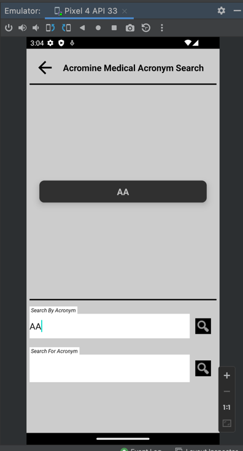

Application used to retrieve Acromine Medical Field Acronyms from the Rest Api at:
http://www.nactem.ac.uk/software/acromine/rest.html

- Built using MVVM + Multi-Module architecture + Dependency Injection. 
- Uses a Single Activity with interchangeable RecyclerView.Adapters.

  

*Built and Tested on the Pixel 4 API 33
